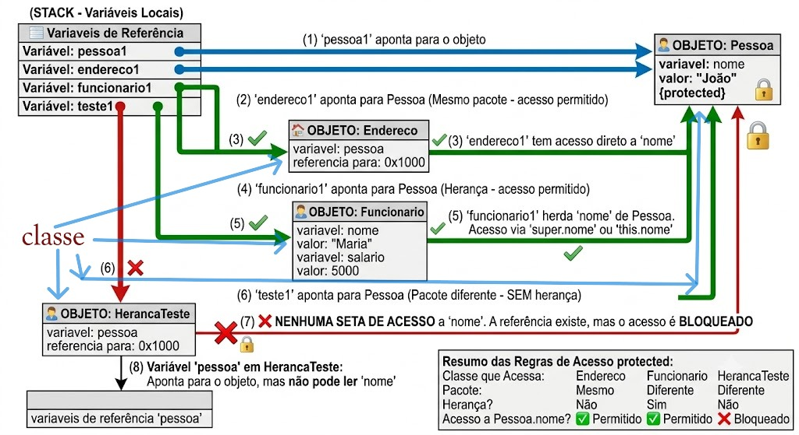

### 3. Suba para o GitHub
Agora que você tem o arquivo salvado no seu computador:

1.  Abra o terminal (ou Use o Git no VS Code).
2.  Navegue até a pasta do seu repositório:
    ```bash
    cd 
    ```
    *(Substitua pelo caminho real da sua pasta do projeto, já que o número que você mandou parece ser o nome de uma imagem, não da pasta)*.
3.  Adicione o arquivo ao Git:
    ```bash
    git add README.md
    ```
4.  Faça o commit:
    ```bash
    git commit -m "Adicionar README com resumo dos estudos em Java"
    ```
5.  Envie para o GitHub:
    ```bash
    git push origin main
    ```
    *(Se seu ramo se chamar `master` em vez de `main`, use `git push origin master`)*.

### 4. (Opcional) Adicione sua imagem
Se quiser colocar a imagem que você mencionou (`f663e926-9527-4915-a396-05be23ef98e8.jpg`):
1.  Crie uma pasta chamada `assets` dentro do seu repositório.
2.  Mova a imagem para dentro dessa pasta.
3.  Atualize o `README.md` para incluir a imagem:
    ```markdown
    
    ```
4.  Faça o commit e o push novamente.

Ao subir tudo, vá até o site do GitHub e atualize a página. O seu README aparecerá no topo! Se precisar de ajuda com o comando exato do Git ou com o caminho da pasta, me avise.


Qwen VL 30B

posso fazer isso usdando o intelij
Sim, com certeza! O IntelliJ IDEA tem integração nativa com o Git e torna esse processo muito mais visual e fácil do que usar apenas o terminal.

Aqui está como fazer isso direto pelo IntelliJ:

1. Adicionar a imagem e o README ao projeto
   Coloque os arquivos na pasta do projeto:
   No Project View (painel esquerdo), certifique-se de estar na pasta raiz do seu projeto.
   Crie uma pasta chamada assets (clique com botão direito na raiz -> New -> Directory).
   Arraste sua imagem (f663e926...jpg) para dentro da pasta assets.
   Crie o arquivo README.md na raiz do projeto (clique com botão direito na raiz -> New -> File -> digite README.md).
   Cole o conteúdo que te passei anteriormente dentro do README.md.